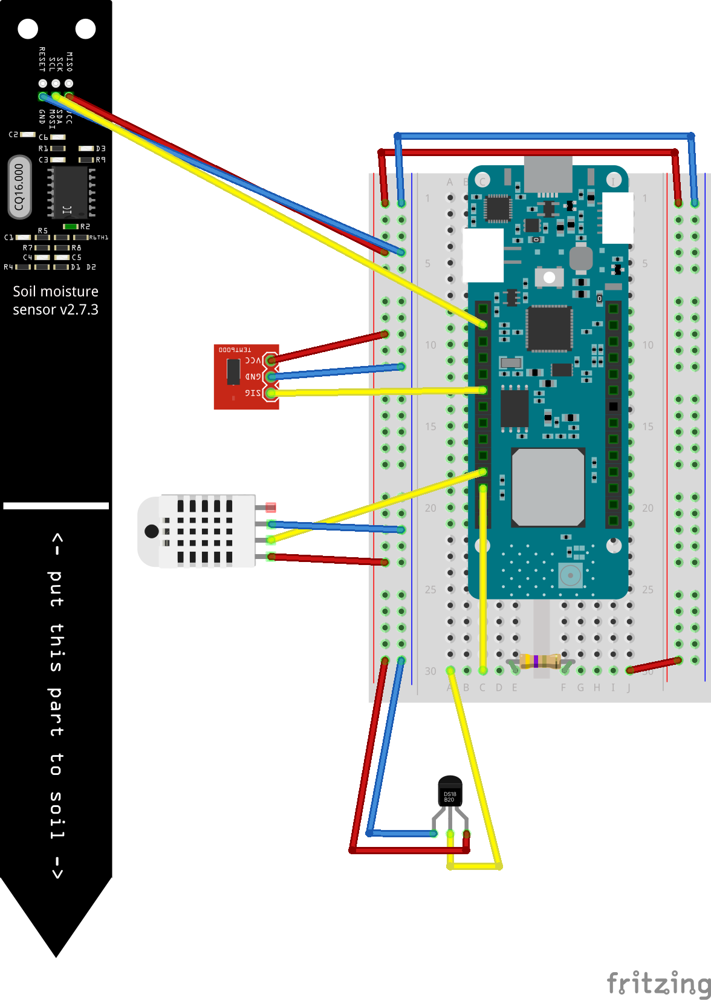

# Plant Buddy with Thing Network

This README will help guide you through the process or wiring and connecting a Arduino-WAN-1310 to the Thing Network. The example is based off the original Plant Buddy Demo. 


## Hardware List
List of hardware required to recreate demo: 
### Control Board
- [Arduino-MKR-WAN-1310](https://store-usa.arduino.cc/products/arduino-mkr-wan-1310)

### Sensor List
- [DS18B20 Temperature Sensor(Waterproof)](https://randomnerdtutorials.com/guide-for-ds18b20-temperature-sensor-with-arduino/)
- [Soil Moisture Sensor v1.2](https://how2electronics.com/interface-capacitive-soil-moisture-sensor-arduino/)
- [Photoresistor module](https://arduinomodules.info/ky-018-photoresistor-module/)
- [DH11 Temperature Humidity Sensor](https://create.arduino.cc/projecthub/pibots555/how-to-connect-dht11-sensor-with-arduino-uno-f4d239)

### Hardware Wiring



## Hardware Setup
1. Wire your WAN-1310 based on hardware wiring provided. Although not required I highly recommed using a breadboard, this saves you soldering the wires to the controller.
2. Create a Thing Network account [here](https://account.thethingsnetwork.org/)
3. Go to [applications](https://eu1.cloud.thethings.network/console/applications) and click create new application.
4. Once you have created a new application, enter it and click on end devices.
5. I now advise following the offical connection guide [here](https://docs.arduino.cc/tutorials/mkr-wan-1300/the-things-network)
6. Once complete you can now edit [plant_buddy_arduino_MKR_1310](plant_buddy_arduino_MKR_1310.ino). Change the following to fit your end device credentials:
```cpp
String appEui = "######";
String appKey = "######";
```
7. Load the project onto your WAN-1310

## Thing Network -> Telegraf -> InfluxDB
1. We are now ready to send our sensor data to InfluxDB. To start make sure you have an instance of [InfluxDB OSS](https://docs.influxdata.com/influxdb/v2.1/install/) installed or signed up for a free cloud tier of [InfluxDB Cloud](https://www.influxdata.com/products/influxdb-cloud/).
2. Create a bucket called thing-network
3. Install [Telegraf](https://docs.influxdata.com/telegraf/v1.21/introduction/downloading/) on your computer
4. Head back to your application in Thing Network and go to: integrations -> MQTT
5. generate a new api key (hold onto this)
6. Modify the [MQTT input plugin](telegraf-mqtt-thing-network.conf) with your credentials
```toml
[[inputs.mqtt_consumer]]
alias = "thing_network_consumer"


  servers = ["tcp://eu1.cloud.thethings.network:1883"]
  topics = ["#"]


  username = "${THING_USERNAME}"
  password = "${THING_API_KEY}" 
  data_format = "json"
  json_string_fields = ["uplink_message_frm_payload"]

```
7. Start your Telegraf service. 


## Contributing
Pull requests are welcome. For major changes, please open an issue first to discuss what you would like to change.

Please make sure to update tests as appropriate.
